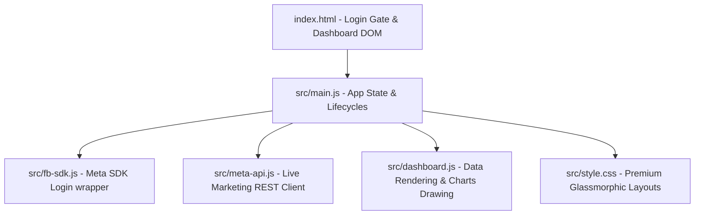

# ⚡ AdPulse Analytics — Meta Ads Reporting Tool

AdPulse Analytics is a premium, high-fidelity, **100% client-side web application** designed for marketers, developers, and advertisers to query, analyze, and visualize Facebook and Instagram advertising campaign performance in real-time.

Built as a single-page app (SPA) powered by Vite, AdPulse communicates directly with the **Meta Graph Marketing API** from the browser. It features a stunning glassmorphic UI, rich interactive charts, granular performance reporting tables, and complete local-memory data privacy (no backend database servers or external token logging).

---

## 🌟 Core Features

### 1. 🔒 Privacy-First Client-Side Architecture
* **Zero Database Logging:** No backend databases or proxy servers are involved. Access tokens and configuration states are saved strictly in your browser's local memory (`localStorage`).
* **Direct Graph API Calls:** Queries route directly from your browser to Meta's secure Graph API endpoints (`https://graph.facebook.com/v18.0/*`).
* **Absolute Isolation:** Since data remains local, multiple users can visit the same URL, and each person's data and connection tokens are kept 100% private and isolated.

### 2. 🎨 Premium Modern Design & UI Experience
* **Rich Dark Aesthetics:** Beautiful deep HSL slate background with neon-accented icons and glowing borders.
* **Glassmorphic Panels:** Modern card structures styled with dynamic backdrops, blur filters, and hover micro-animations.
* **Custom Scrollbars & Layouts:** Premium scroll indicators and a responsive collapsible sidebar optimized for desktop and mobile viewports.

### 3. 📊 Advanced Reports & Visualizations
* **KPI Dashboards:** Track Total Spend, Conversions, Impressions, Avg. CTR, Avg. CPC, and ROAS with automatic trend calculations.
* **Performance Timelines:** Rich SVG visualizations using ApexCharts showing daily spend trends mapped against conversion occurrences.
* **Placements & Channels:** Dynamic donut chart showing budget allocations across Facebook, Instagram, Audience Network, and Messenger.
* **Campaigns & Ad Sets Tables:** Sortable, searchable reporting tables supporting inline status filtering, instant search, and columns sorting.
* **CSV Exporter:** Download full reports containing metrics, objectives, delivery statuses, and spend breakdowns in a single click.

### 4. 🚀 Dynamic Meta Setup & Help Wizard
* **Visible App ID Configuration:** Promote your own custom Facebook App ID right from the login card or settings dashboard.
* **On-Screen 5-Step Wizard:** An interactive, step-by-step modal guide detailing Meta Developer registration, App creation, product linking, redirect settings, and launching.
* **Dynamic Redirect URI Calculator:** Automatically detects the active domain URL (e.g. `http://localhost:3000` or `https://ad-pulse-meta-ads.vercel.app`) with one-click clipboard copying shortcuts to facilitate pasting into the Facebook Login Redirect settings console.

---

## 🛠️ Quick Start (Local Development)

### Prerequisites
* **Node.js** (v18 or higher recommended)
* A **Meta Developer Account** (to configure your own App ID)

### Setup Instructions

1. **Clone the repository:**
   ```bash
   git clone https://github.com/YOUR_USERNAME/AdPulse-Meta-Ads.git
   cd AdPulse-Meta-Ads
   ```

2. **Install dependencies:**
   ```bash
   npm install
   ```

3. **Start the development server:**
   ```bash
   npm run dev
   ```
   Open your browser and navigate to **`http://localhost:3000/`**.

4. **Build for production:**
   ```bash
   npm run build
   ```
   Compiles static HTML/CSS/JS bundles under the `dist/` directory.

---

## 🌐 Deploying to Production (Vercel)

AdPulse is completely static and compiles into HTML/CSS/JS assets, making it exceptionally easy to host on static hosting providers like **Vercel**, **Netlify**, or **GitHub Pages**.

To deploy to Vercel:
1. Connect your GitHub repository to Vercel.
2. Configure the **Build Command** to `npm run build` and **Output Directory** to `dist`.
3. Deploy! Vercel will compile and serve the main dashboard, Privacy Policy (`/privacy.html`), and Terms of Service (`/terms.html`) pages perfectly.

---

## 📘 Meta Developer App Setup (Settings > Basic)

To hook up this dashboard to live Meta advertising accounts, you must register a **Meta Developer Application**:

1. **Register**: Navigate to [developers.facebook.com](https://developers.facebook.com/) and register as a developer.
2. **Create App**: Click **Create App** -> Choose **Other** -> Select **Business** as the App Type (critical for Marketing API).
3. **Add Products**: Add the **Facebook Login** and **Marketing API** products to your App.
4. **Configure Redirect URIs**: Under **Facebook Login > Settings**:
   * Set **Valid OAuth Redirect URIs** to your active website URL (e.g. `http://localhost:3000/` or `https://ad-pulse-meta-ads.vercel.app/`).
   * Set **Allowed Domains for the JavaScript SDK** to the same domain origins.
   * Toggle **Login with JavaScript SDK** to **Yes**.
5. **Add Compliance Links** (Required to switch from Development to Live mode):
   Use the compliance links automatically generated in the **Setup & API** tab of your dashboard:
   * **App Domains**: `your-domain.com`
   * **Privacy Policy URL**: `https://your-domain.com/privacy.html`
   * **Terms of Service URL**: `https://your-domain.com/terms.html`
   * **User Data Deletion Instructions**: `https://your-domain.com/privacy.html`
6. **Go Live**: Request advanced features access (`ads_read` and `business_management`) under **App Review > Permissions and Features** and toggle the app mode to **Live**.

---

## 📂 Codebase Architecture



* **`index.html`**: Semantic single-page layout structure containing the Auth gate, dynamic dashboard views, and the step-by-step wizard.
* **`privacy.html` / `terms.html`**: Legally compliant documentation pages satisfying Meta developer guidelines.
* **`src/main.js`**: Central application state coordinator managing session transitions and boot lifecycles.
* **`src/fb-sdk.js`**: Native Facebook JavaScript SDK wrapper managing async loading and oauth scopes.
* **`src/meta-api.js`**: REST client querying campaigns, adsets, business portfolios, and placements directly from Meta's API.
* **`src/dashboard.js`**: Integrates KPI summaries, updates lists, and binds table sorters.
* **`src/style.css`**: Deep dark variables, animations, scroll indicators, and responsiveness breakpoints.

---

## 🔒 Security Notice

This application is completely decentralized. **We never see, store, or transmit your marketing metrics or Facebook access tokens.** Your token remains cached on your browser and is only sent to Facebook's official Graph API. Your commercial analytics remain 100% private.
